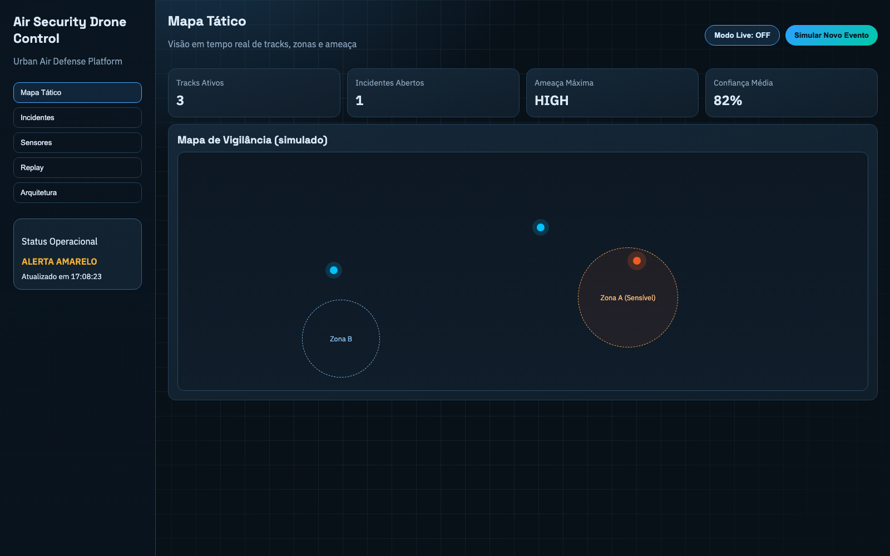
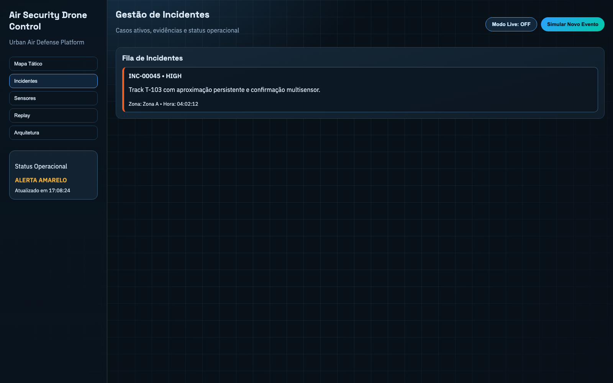
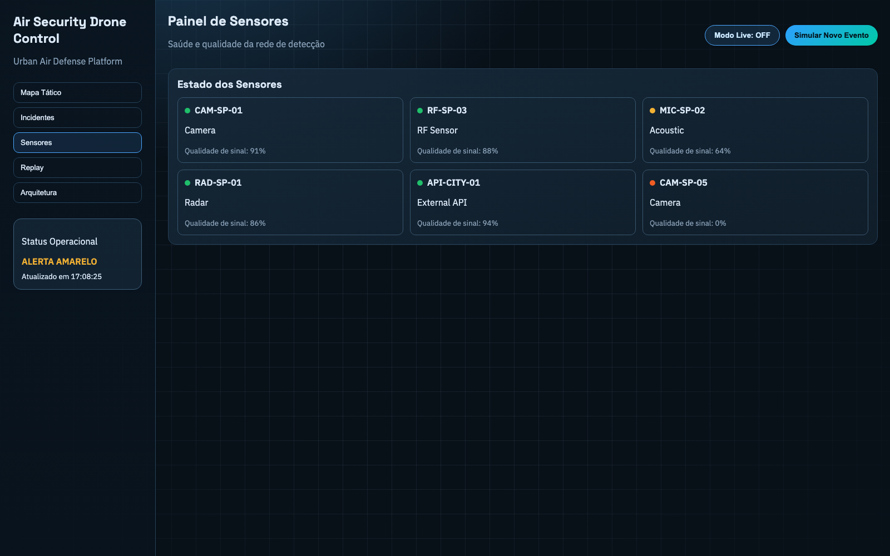
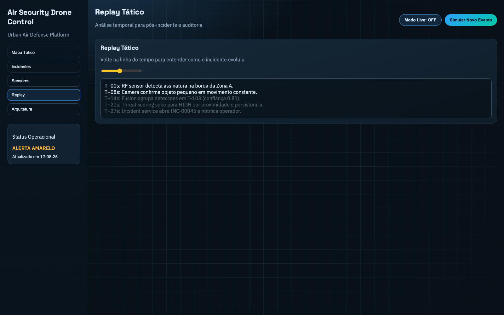
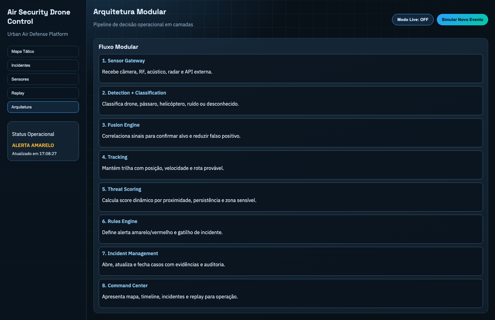

# Air Security Drone Control

Plataforma modular de conciencia situacional aerea para deteccion, clasificacion, fusion, tracking y respuesta operativa contra amenazas en bajo espacio aereo urbano.

> Este README es la fuente oficial del estado del producto y sera actualizado continuamente en cada evolucion relevante.

## Objetivo del MVP

- Ingerir detecciones multisensor.
- Fusionar detecciones para reducir falsos positivos.
- Calcular threat score dinamico.
- Abrir y actualizar incidentes.
- Exponer una vista consolidada para el centro de mando.

## Stack inicial

- ASP.NET Core (.NET 9) para APIs de servicio.
- C# para dominio y orquestacion.
- PostgreSQL + PostGIS (planificado).
- Redis para estado/cache rapido (planificado).
- Kafka para eventos (planificado).

## Estructura del repositorio

```text
apps/
  command-center-prototype/
src/
  BuildingBlocks/
    AirSecurityDroneControl.BuildingBlocks/
  Services/
    SensorGateway.Api/
    Fusion.Api/
    ThreatScoring.Api/
    Incidents.Api/
    RulesEngine.Api/
    Notifications.Api/
    Evidence.Api/
  CommandCenter/
    CommandCenter.Api/
docs/
  drone-xone-airspace-blueprint.md
  feature-matrix.md
  p0-execution-backlog.md
  local-runbook.md
  architecture.md
  mvp-roadmap.md
  event-flow.md
scripts/
  run-p0-stack.sh
  stop-p0-stack.sh
  p0-e2e-demo.sh
  p0-smoke-test.sh
docker-compose.yml
```

## Prototipo visual (producto primero)

Antes de cerrar el backend completo, el flujo operativo se esta validando visualmente en el Command Center:

- `apps/command-center-prototype/index.html`
- Mapa tactico, incidentes, sensores, replay y flujo modular.
- Modo Live para consumir datos reales del backend (`http://127.0.0.1:5105`).

## Screenshots

Capturas actuales de la interfaz del Command Center:







Ejecucion:

```bash
cd apps/command-center-prototype
python3 -m http.server 4173
```

Acceso:

- `http://127.0.0.1:4173`

## Contratos de API (OpenAPI)

Especificaciones iniciales de los modulos MVP:

- `docs/api/sensor-gateway.openapi.yaml`
- `docs/api/fusion.openapi.yaml`
- `docs/api/threat-scoring.openapi.yaml`
- `docs/api/incidents.openapi.yaml`
- `docs/api/command-center.openapi.yaml`
- `docs/api/rules-engine.openapi.yaml`
- `docs/api/notifications.openapi.yaml`
- `docs/api/evidence.openapi.yaml`

## Blueprint del Producto

Documento completo de la vision de plataforma y capacidades:

- `docs/drone-xone-airspace-blueprint.md`

## Matriz de Entrega

Priorizacion ejecutable de funcionalidades por fase:

- `docs/feature-matrix.md`

## Backlog P0

Plan tecnico detallado para completar el MVP operativo:

- `docs/p0-execution-backlog.md`

## Runbook Local

Guia rapido de operacion y troubleshooting local:

- `docs/local-runbook.md`

## Seguridad Operativa (Dev)

- Todos los endpoints mutables exigen:
  - Header `X-API-Key: dev-local-key`
  - Header `X-Role: operator` o `admin` (segun el endpoint)
- La lectura publica (GET) permanece abierta en el entorno local.

## Observabilidad Basica

- Cada servicio expone `GET /metrics/basic` con contadores de requests por ruta y codigo de estado.

## Como ejecutar en local

1. Restaurar y compilar:

```bash
dotnet restore
dotnet build AirSecurityDroneControl.sln
```

2. Levantar stack P0 con un comando:

```bash
dotnet build AirSecurityDroneControl.sln
./scripts/run-p0-stack.sh
```

3. Ejecutar demo end-to-end:

```bash
./scripts/p0-e2e-demo.sh
```

4. Detener stack:

```bash
./scripts/stop-p0-stack.sh
```

5. Ejecutar smoke test de salud y seguridad:

```bash
./scripts/p0-smoke-test.sh
```

Opcional (manual): levantar servicios en terminales separados:

```bash
dotnet run --project src/Services/SensorGateway.Api --urls http://127.0.0.1:5101
dotnet run --project src/Services/Fusion.Api --urls http://127.0.0.1:5102
dotnet run --project src/Services/ThreatScoring.Api --urls http://127.0.0.1:5103
dotnet run --project src/Services/Incidents.Api --urls http://127.0.0.1:5104
dotnet run --project src/CommandCenter/CommandCenter.Api --urls http://127.0.0.1:5105
dotnet run --project src/Services/RulesEngine.Api --urls http://127.0.0.1:5106
dotnet run --project src/Services/Notifications.Api --urls http://127.0.0.1:5107
dotnet run --project src/Services/Evidence.Api --urls http://127.0.0.1:5108
```

Verificacion rapida:

```bash
curl -s http://127.0.0.1:5101/health
curl -s http://127.0.0.1:5102/health
curl -s http://127.0.0.1:5103/health
curl -s http://127.0.0.1:5104/health
curl -s http://127.0.0.1:5105/health
curl -s http://127.0.0.1:5106/health
curl -s http://127.0.0.1:5107/health
curl -s http://127.0.0.1:5108/health
```

## Estado actual

Este repositorio contiene el bootstrap de arquitectura y endpoints de dominio para:

- `DetectionEvent`
- `FusedTrack`
- `ThreatAssessment`
- `IncidentCase`
- `RulePolicy`
- `NotificationMessage`
- `EvidenceItem`

Persistencia durable local (JSON) y event log local estan activos en `.runtime/data/<service>`.
Mensajeria distribuida y autenticacion enterprise quedan para las proximas iteraciones.

## Evolucion continua (compromiso)

Cada nueva iteracion debe:

1. Implementar una capacidad real (no solo mock).
2. Actualizar este README con:
   - lo que se incorporo,
   - como ejecutar,
   - como validar,
   - lo que aun falta.
3. Mantener trazabilidad entre UI, contratos y servicios.

## Fases y criterio de listo

### Fase 1 - Visual + Contratos (en curso)
- [x] Prototipo de Command Center navegable.
- [x] Contratos de dominio iniciales.
- [ ] Contrato HTTP formal (OpenAPI) por modulo.

### Fase 2 - Backend operativo MVP
- [ ] Pipeline real: ingesta -> fusion -> threat -> incidente.
- [ ] Persistencia de incidentes y tracks.
- [ ] Reglas de alerta por zona configurable.
- [ ] Endpoint de overview alimentando la UI sin datos simulados.

### Fase 3 - Integracion multisensor
- [ ] Adaptadores para camara, RF, radar y audio.
- [ ] Normalizacion de detecciones por tipo de sensor.
- [ ] Correlacion tiemporal y geoespacial multi-fuente.

### Fase 4 - Produccion
- [ ] Kafka (o equivalente) para eventos.
- [ ] Observabilidad (OpenTelemetry + Prometheus + Grafana).
- [ ] Autenticacion, autorizacion y trazabilidad de auditoria.
- [ ] Deploy contenerizado y runbook operativo.

## Definicion de funcional (para este proyecto)

El sistema sera considerado funcional cuando:

1. Detectar eventos de al menos 2 tipos de sensor reales.
2. Confirmar objetivo con fusion multisensor y confianza trazable.
3. Generar threat score y incidente automaticamente por regla.
4. Mostrar todo en tiempo real en el Command Center.
5. Permitir replay completo del incidente con timeline y evidencias.
